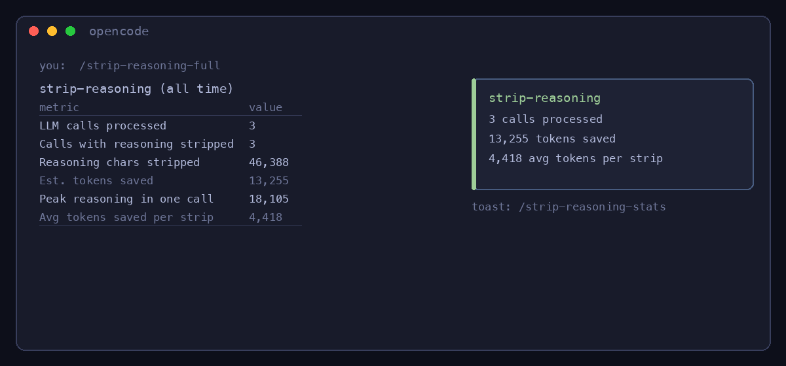

# opencode-strip-reasoning

   

<p align="center">
  
</p>

An opencode plugin that stops reasoning models from re-reading their own discarded thinking on every turn.

Reasoning models think before they answer. The thinking lands in conversation history. The history replays to the model on every subsequent turn. So every turn after the first, the model re-reads its own rejected approaches and wrong turns before it can produce a single token of new work.

You would not work this way. You do not re-read your crossed-out paragraphs before writing the next sentence. Every AI coding tool currently works this way.

## The problem

Reasoning models drop their chain-of-thought traces into conversation history as `reasoning`-type message parts. Opencode stores them and sends them back in full on every turn.

The traces are large, typically 10-20x the size of the actual text output, and thinking budgets can run 32K tokens per turn. Three turns in, 96K tokens of raw reasoning can sit in context before any real work happens. The useful window shrinks by 50-70% while the file you are editing competes for attention with the model's deliberation from two turns ago.

## Why mixture-of-experts models make this worse

Mixture-of-experts architecture runs selective activation. Only a slice of the experts fire per token, and the thinking you see is not one voice. It is the model running through multiple expert routes, testing hypotheses in parallel, and settling on a path. The thinking trace looks like this:

> let me try approach A... actually no, that won't work because the import graph is wrong

> what about B? hmm, B has a race condition

> okay C. C works because... [actual correct reasoning]

That trace is the model's scratchpad. It contains:

- abandoned hypotheses the model already rejected
- self-corrections that are no longer relevant
- dead-end code paths
- intermediate reasoning that led nowhere useful

The experts talk to each other through the trace. A routing network scores the candidates for each token, the top experts contribute, and when the output does not fit, the trace loops back and the router tries a different set. The deliberation between experts is sometimes longer than the verdict itself, and every round of it lands in history. The final text already contains the conclusions, so the verdict is what the next turn needs. The deliberation is not. But the deliberation is what sits in your context window, and on MoE models it fills up fast, because parallel expert negotiation produces exactly the kind of long, exploratory, self-correcting traces that pile up the quickest.

Feeding the deliberation back makes the model attend to its own rejected routes as if they were established context. "I considered X last turn" becomes implicit weight toward X, even though the model decided X was wrong.

The reasoning trace is working memory. Treating it as persistent context is a design mistake, and this plugin is the correction.

## The fix

Opencode exposes a plugin hook, `experimental.chat.messages.transform`, which hands you the message array right before it goes to the LLM. Filter out the reasoning parts. That is the whole plugin:

```typescript
import type { Plugin, Hooks } from "@opencode-ai/plugin";

const plugin: Plugin = async (_input, _options) => {
  const hooks: Hooks = {
    "experimental.chat.messages.transform": async (_input, output) => {
      output.messages = output.messages.map((msg) => ({
        ...msg,
        parts: msg.parts.filter((part) => part.type !== "reasoning"),
      }));
    },
  };
  return hooks;
};

export default { server: plugin };
```

Text stays. Tool calls stay. Tool results stay. The reasoning goes. The model receives its own history as if it had spoken concisely the first time.

The model still thinks. Reasoning is inference-time behavior: it happens during generation, not because of context. Every turn gets fresh thinking at full depth. What stops is paying for the old thinking twice.

## Measured savings

I instrumented the hook to log before and after counts on every LLM call:

| conversation | reasoning parts | chars stripped | tokens saved | context payload |
|---|---|---|---|---|
| 3 messages | 1 | 13,959 | 3,989 | **94.2%** |
| 5 messages | 2 | 14,324 | 4,093 | **90.2%** |
| 33 messages | 4 | 18,105 | 5,173 | **81.0%** |

The entry that started this: 13,959 characters of reasoning against 764 characters of actual output, re-sent on every turn. Across sessions the average settles around 85% of the payload being old thinking. Not new information, not user input, not tool results. The model's crossed-out notes, re-processed and re-billed every turn.

I threw it away. Nothing broke. The conclusions were always in the text.

## Install

Not yet on npm. Install from source:

```bash
git clone https://github.com/santura-dev/opencode-strip-reasoning
cd opencode-strip-reasoning
npm install && npm run build
```

Point your opencode config at the local checkout:

Server plugin, in `opencode.json`:

```json
{
  "plugin": [
    ["/absolute/path/to/opencode-strip-reasoning", { "mode": "strip" }]
  ]
}
```

The stats slash command is a TUI plugin, which loads from `tui.json` (same directory, create it if missing), not from `opencode.json`:

```json
{
  "plugin": [
    "/absolute/path/to/opencode-strip-reasoning"
  ]
}
```

Restart opencode. To confirm the plugin loaded, add `"debug": true` to the plugin options and look for `opencode-strip-reasoning active: mode=strip` on startup. Run a multi-turn session with a reasoning model and check `/strip-reasoning-stats`.

Updates: `git pull && npm run build`, restart opencode.

## Requirements

- [opencode](https://opencode.ai) with plugin support
- a reasoning model (GLM, DeepSeek-R1, or any model that emits `reasoning` parts)

## Configuration

The plugin accepts options as the second element of the plugin entry. Defaults work for most setups.

| option | default | values |
|---|---|---|
| `mode` | `"strip"` | `"strip"`, `"summarize"`, `"keep-last"` |
| `keepCount` | `0` | any non-negative integer, used by `keep-last` |
| `log` | `true` | set `false` to disable the JSONL log |
| `debug` | `false` | set `true` to print the startup confirmation line |

<details>
<summary><strong>Default configuration</strong> (click to expand)</summary>

```json
{
  "plugin": [
    ["/path/to/opencode-strip-reasoning", { "mode": "strip", "keepCount": 0, "log": true }]
  ]
}
```

**strip** (default) removes every reasoning part from history. Maximum savings, and the one you probably want.

**summarize** replaces each reasoning part with `[reasoning omitted]`. The model knows thinking happened but does not see the content.

**keep-last** keeps the N most recent reasoning blocks and strips the rest. Useful for continuity with the immediately previous turn:

```json
["/path/to/opencode-strip-reasoning", { "mode": "keep-last", "keepCount": 1 }]
```

Invalid values fall back safely: a typo'd `mode` logs an error and uses `strip`; a negative `keepCount` logs and uses `0`.

</details>

## Stats

The plugin tracks savings per session and exposes them three ways:

- `/strip-reasoning-stats`: toast with the savings summary
- `/strip-reasoning-full`: prints the full stats table into the chat
- `strip_reasoning_stats` tool: the model can report savings on request

All-time numbers are computed from the JSONL log at `~/.opencode-strip-reasoning.log`, which rotates at 5MB. Set `"log": false` in the plugin options to disable logging entirely.

## Benchmark

`benchmark.sh` runs the same 3-turn task with and without the plugin and compares token usage from session exports. Set `MODEL` at the top to whatever you run.

## Development

```bash
npm run lint          # oxlint
npm run format        # prettier
npm run build         # tsup (esm + dts)
npm test              # vitest
```

## Caveats

The `experimental.` prefix on the hook means it can change between opencode versions, so check after upgrading. Stripping also means the model has no memory of its own prior reasoning, which does not matter for self-contained responses but could matter for long multi-step reasoning where the model refers back to earlier thinking. I found one such instance in hundreds of sessions: the model re-derived the same hypothesis at the cost of a few hundred tokens against several thousand saved. If that concerns you, run `keep-last` with `keepCount: 1`.

This affects history only. Fresh reasoning during generation is untouched.

## License

MIT
